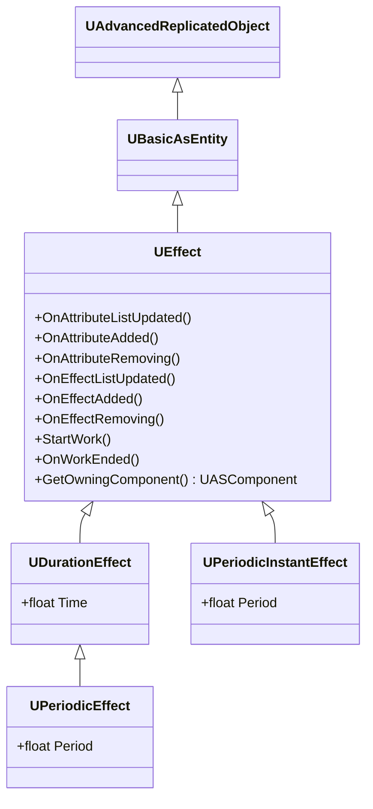
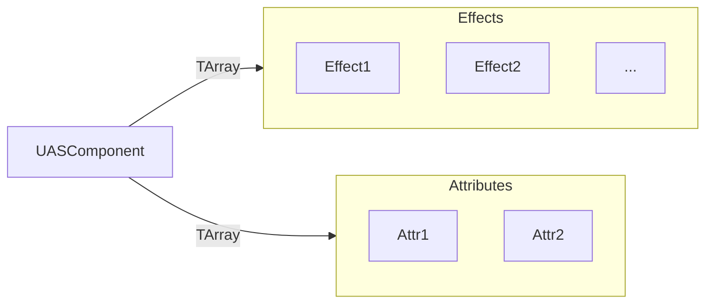

# Ability System Plugin

## About the plugin

> [Github Repository](https://github.com/ArtemIyX/AbilitySystemUnreal)

Author plugin written for Riftborn. It implements the "attributes" and "effects" system.

- **Attributes** are entities that store a float variable.
- **Effects** are entities that modify attributes.

## Attributes

You can create your own attributes by inheriting from *UAttribute*.

```c++ title="ArmorAttribute.h"
UCLASS(Blueprintable, BlueprintType)
class HUM_API UArmorAttribute : public UAttribute
{
	GENERATED_BODY()

public:
	UArmorAttribute(const FObjectInitializer& InObjectInitializer = FObjectInitializer::Get());

public:
	virtual FString GetDebugString_Implementation() const override;
};

```
!!! info
    Be sure to overwrite the *GetDebugString* function so that other developers can understand which 
    attribute currently exists on the actor.

---

There are some events that can be useful for tracking the status of Attribute:
- OnMinValueChanged
- OnMaxValueChanged
- OnValueChanged
- OnValueMinThresholdReached
- OnValueMaxThresholdReached
 
## Effects

There are only 4 types of effect in the plugin:

- Effect
- PeriodicInstantEffect
- DurationEffect
- PeriodicEffect 



### Effect
UEffect is the base abstract class for all effects.

```c++ title="Effect.h"
class ABILITYSYSTEM_API UEffect : public UBasicAsEntity
```
!!! note
    It automatically receives notifications about changes to other effects and attributes.

When an effect is added, it starts working. When an effect is removed, it finishes the job.

```c++ title="Effect.h"
UFUNCTION(BlueprintNativeEvent, Category="Effect|Main")
void StartWork();

UFUNCTION(BlueprintNativeEvent, Category="Effect|Main")
void OnWorkEnded();
```

!!! warning "Effect life cycle"
    You can call **EndWork()** to terminate the effect.

    This will call the **EffectHasEnded(this)** method of the effect owner (*GetOwningComponent()*), which will properly clear memory and remove the effect from the array by calling **OnWorkEnded()** and **ConditionalBeginDestroy()** on it

### PeriodicInstantEffect
PeriodicInstantEffect starts a looped timer for an "Tick" action.

```C++ title="PeriodicInstantEffect.h"
class ABILITYSYSTEM_API UPeriodicInstantEffect : public UEffect
```


!!! note
    On **StartWork()** it calls **RunPeriodicTimer()**, on **EndWork()** it calls **ClearPeriodicTimer()**


```C++ title="PeriodicInstantEffect.cpp"
void UPeriodicInstantEffect::RunPeriodicTimer()
{
	FTimerManager& manager = GetWorld()->GetTimerManager();
	if (manager.IsTimerActive(PeriodicTimerHandle))
		manager.ClearTimer(PeriodicTimerHandle);
	manager.SetTimer(PeriodicTimerHandle, FTimerDelegate::CreateUObject(this, &UPeriodicInstantEffect::PeriodTick),
	                 FMath::IsNearlyZero(Period) ? 0.1f : Period, true);
}

void UPeriodicInstantEffect::ClearPeriodicTimer()
{
	FTimerManager& manager = GetWorld()->GetTimerManager();
	if (manager.IsTimerActive(PeriodicTimerHandle))
		manager.ClearTimer(PeriodicTimerHandle);
}
```

You just need to override **PeriodTick()** in your class for looped actions.

```C++ title="PeriodicInstantEffect.h"
/**
* @brief Called periodically
*
* The `PeriodTick` function is executed at regular intervals while the effect is active. It allows the developer
* to define custom logic that should occur periodically, such as applying damage, healing, or other time-based effects.
* This function is intended to be overridden in derived classes for specific behavior.
*/
UFUNCTION(BlueprintNativeEvent)
void PeriodTick();
```

You can adjust the intervals of the effect in Blueprints by changing the ‘Period’ field.

```C++ title="PeriodicInstantEffect.h"
UPROPERTY(BlueprintReadWrite,
	EditDefaultsOnly,
	meta=(UIMin="0.0001",
		ClampMin="0.0001"),
	Category="PeriodicEffect")
float Period;
```

### DurationEffect

This effect activates a timer at the beginning of its work. When the timer expires, the effect automatically ends.
Useful for temporary effects such as "damage protection".

```c++ title="DurationEffect.h"
class ABILITYSYSTEM_API UDurationEffect : public UEffect
```

You can adjust the time of the effect in Blueprints by changing the ‘Time’ field.

```c++ title="DurationEffect.h"
UPROPERTY(BlueprintReadWrite,
	EditDefaultsOnly,
	meta=(UIMin="0.0001",
		ClampMin="0.0001"),
	Category="DurationEffect")
float Time;
```

### PeriodicEffect

This effect inherits UDurationEffect, but has the same tick logic as PeriodicInstantEffect.

!!! tip inline
    Can be useful for effects like ‘Health Regeneration’, where the effect restores 25 health every second, but disappears after 5 seconds.

```c++ title="PeriodicEffect.h"
class ABILITYSYSTEM_API UPeriodicEffect : public UDurationEffect
```

```c++ title="PeriodicEffect.h"
UFUNCTION(BlueprintNativeEvent)
void PeriodTick();
```

## Ability System Component

This class is the main manager in the effects and attributes system.
It contains effects and attributes as an array of objects and operates them.

```c++ title="ASComponent.h"
class ABILITYSYSTEM_API UASComponent : public UActorComponent
```



!!! warning
    Since this is a actor component, there is no limit to the number of component per actor, but **1 manager per 1 actor is recommended**. This will make it easier to manipulate objects

---

There are some events that can be useful for tracking the status of Ability System Component:

- OnEffectAdded
- OnEffectStacked
- OnEffectRemoved
- OnEffectListUpdated
- OnAttributeAdded
- OnAttributeRemoved
- OnAttributeListUpdated

!!! tip
    You can overwrite any methods in a class for custom managers

## Attribute Management

You can use the following methods to handle the attributes of this component:

- [Add Attribute](#add-attribute)
- [Remove Attribute](#remove-attribute)
- [Get Attribute](#get-attribute)
- [Has Attribute](#has-attribute)
- [Get Attribute List](#get-attribute-list)
---

### Add Attribute 

> This method adds a new attribute on a class basis. You will be able to edit the attribute after adding it.

```C++ title="ASComponent.h"
virtual UAttribute* AddAttribute(TSubclassOf<UAttribute> AttributeClass);
```

!!! note "Notification system"
    All attributes and all effects will be notified of the new attribute and that the attribute list has changed.
        ```C++
        for (int32 i = 0; i < n; ++i)
        {
            Attributes[i]->OnAttributeAdded(temp);
            Attributes[i]->OnAttributeListUpdated();
        }
        ```

!!! warning "Duplicate exception"
    You can only add one attribute of a single class. If you try to add another duplicate, the method will ignore the attempt and return nullptr.
        ```c++
        if (IsValid(entity) && entity->IsA(AttributeClass)) return nullptr;
        ```

---

### Remove Attribute

> The methods remove the attribute from the attribute array.

```C++ title="ASComponent.h"
virtual void RemoveAttributeByEntity(UAttribute* InAttribute);
virtual void RemoveAttributeByClass(TSubclassOf<UAttribute> AttributeClass);
```

!!! note "Notification system"
    All attributes and all effects will be notified of the selected attribute and that the attribute list has changed.

!!! warning "Memory clearing"
    The object is cleared from memory after deletion and is no longer available. Make sure you clear memory (timers, allocated memory within the object, linked systems, etc.)

---

### Get Attribute    

> The method returns the first attribute in the list that matches the class.
> If there are two attributes with the same class in the array, it will return the first one. 

```C++ title="ASComponent.h"
virtual UAttribute* GetAttribute(TSubclassOf<UAttribute> AttributeClass);
```

!!! note "Object Class"
    The object class check is performed as follows:
    ```C++
    if (IsValid(attribute) && attribute->IsA(AttributeClass))
    ```
    
!!! warning "Nullptr return"
    Returns **nullptr** if the attribute could not be found.

---

### Has Attribute

> Checks if the attribute is in the list. Uses GetAttribute() to get the attribute.
```C++ title="ASComponent.h"
virtual bool HasAttribute(TSubclassOf<UAttribute> AttributeClass) const;
```

---

### Get Attribute List

> Getter for a list of attributes. Returns the current state of attribute list

```C++ title="ASComponent.h"
virtual void GetAttributeList(TArray<UAttribute*>& OutAttributes);
```

---

### Attribute Execution order

=== "Add Attribute Exeuction Order"
        1. Attributes.Add()
        2. Attribute->StartWork()
        3. Attributes:  OnAttributeAdded, OnAttributeListUpdated
        4. Effects:     OnAttributeAdded, OnAttributeListUpdated
        5. OnAttributeAdded.Broadcast()
        6. OnAttributeListUpdated.Broadcast()
=== "Remove Attribute Execution Order"
        1. OnWorkEnded()
        2. Attributes:  OnAttributeRemoving()
        3. Effects:     OnAttributeRemoving()
        4. OnAttributeRemoved.Broadcast()
        5. Attribute->ConditionalBeginDestroy()
        6. Attributes.RemoveAt(index)
        7. Attributes:  OnAttributeListUpdated()
        8. Effects:     OnAttributeListUpdated()
        9. OnAttributeListUpdated.Broadcast()

## Effect Management

You can use the following methods to handle the attributes of this component:

- [Add Effect](#add-effect)
- [Remove Effect](#remove-effect)
- [Get Effect](#get-effect)
- [Has Effect](#has-effect)
- [Get Effect List](#get-effect-list)

### Add Effect

>The method adds the effect to the list of effects.

```C++ title="ASComponent.h"
virtual UEffect* AddEffect(TSubclassOf<UEffect> EffectClass);
```
!!! note "Notification system"
    All attributes and all effects will be notified of the selected effect and that the effect list has changed.

!!! warning "Stacking"
    If a duplicate effect by class is found, it will try to call **Stack()**.
    
    a. If Stack is successful, **OnEffectStacked()** will be called.

    b. If Stack is not possible, the temporary object will be deleted and the method will **return nullptr**.

---

### Remove Effect

>The methods remove the effect from the effects array.

```C++ title="ASComponent.h"
virtual void RemoveEffectByEntity(const UEffect* InEffect);
virtual void RemoveEffectByClass(TSubclassOf<UEffect> EffectClass);
```

!!! note "Notification system"
    All attributes and all effects will be notified of the selected effect and that the effect list has changed.

!!! warning "Memory clearing"
    The object is cleared from memory after deletion and is no longer available. Make sure you clear memory (timers, allocated memory within the object, linked systems, etc.)

!!! tip "Effect life cycle"
    You don't have to remove the effect from its owner component. You just need to call **EndWork()** on the effect.

    This will call the **EffectHasEnded(this)** method of the effect owner (*GetOwningComponent()*), which will properly clear memory and remove the effect from the array by calling **OnWorkEnded()** and **ConditionalBeginDestroy()** on it

---

### Get Effect

> The method returns the first effect in the list that matches the class.
> If there are two effects with the same class in the array, it will return the first one. 

```C++ title="ASComponent.h"
virtual UEffect* GetEffect(TSubclassOf<UEffect> EffectClass);
```

!!! note "Object Class"
    The object class check is performed as follows:
    ```C++
    if (IsValid(ef) && ef->IsA(EffectClass))
    ```

!!! warning "Nullptr return"
    Returns **nullptr** if the effect could not be found.

---

### Has Effect

> Checks if the effect is in the list. Uses GetEffect() to get the attribute.

```C++ title="ASComponent.h"
virtual bool HasEffect(TSubclassOf<UEffect> EffectClass) const;
```

---

### Get Effect List

> Getter for a list of effects. Returns the current state of effect list
> 
```C++ title="ASComponent.h"
virtual void GetEffectList(TArray<UEffect*>& OutEffects);
```

## Replication

The plugin fully supports replication and uses the [Unreal Push Network Model](https://www.kierannewland.co.uk/push-model-networking-unreal-engine/) to optimise network.

To replicate UObjects, the plugin uses [ReplicatedObject](https://github.com/ArtemIyX/ReplicatedObjectUnreal).

For full functionality, you must enable Push Model in the project and replicate the ASComponent in constructor
```C++
AbilitySystemComponent = CreateDefaultSubobject<UASComponent>(TEXT("AS"));
AbilitySystemComponent->SetIsReplicated(true);
```

```ini title="DefaultEngine.ini"
[SystemSettings]
net.IsPushModelEnabled=1
net.PushModelSkipUndirtiedReplication=1
```

## Examples

You can set specific values to any attribute if you have a need to dynamically configure each attribute for different actors.

```C++ title="AHumAbilityCharacter.cpp"
void AHumAbilityCharacter::AddDefaultAttributes_Implementation()
{
	const int32 n = DefaultAttributes.Num();
	for (int32 i = 0; i < n; ++i)
	{
		const FDefaultPlayerAttribute& el = DefaultAttributes[i];
		if (el.AttributeClass)
		{
			if (UAttribute* entity = AbilitySystemComponent->AddAttribute(el.AttributeClass))
			{
				UAttributeSettingsDataAsset* settings = el.Settings.LoadSynchronous();
				if (IsValid(settings))
				{
					ApplySettingsForAttribute(entity, settings);
				}
			}
		}
	}
}


void AHumAbilityCharacter::ApplySettingsForAttribute_Implementation(
	UAttribute* InAttribute,
	UAttributeSettingsDataAsset* InSettings)
{
	if (IsValid(InAttribute) && IsValid(InSettings))
	{
		InAttribute->SetMinValue(InSettings->MinValue);
		InAttribute->SetMaxValue(InSettings->MaxValue);
		InAttribute->SetValue(InSettings->InitialValue);
	}
}
```

---

You can cache frequently used attributes to make it easier to retrieve them in future code.

```c++ title="AHumAbilityCharacter.cpp"
TObjectPtr<UAttribute> AHumAbilityCharacter::GetHealth() const
{
	if (!HealthAttribute || !IsValid(HealthAttribute.Get()))
	{
		if (AbilitySystemComponent)
		{
			// Remove const from the current object to modify HealthAttribute
			auto nonConstThis = const_cast<AHumAbilityCharacter*>(this);
			nonConstThis->HealthAttribute = AbilitySystemComponent->Attribute(UHealthAttribute::StaticClass());
		}
	}
	return HealthAttribute;
}
```

---

You can bind to attribute events after you have added them to list.

```c++ title="AHumAbilityCharacter.cpp"
void AHumAbilityCharacter::BeginPlay()
{
	Super::BeginPlay();
	if (HasAuthority())
	{
		AddDefaultAttributes();
		AddDefaultEffects();
		if (TObjectPtr<UAttribute> hp = GetHealth())
		{
			hp->OnValueMinThresholdReached.AddDynamic(this, &AHumAbilityCharacter::OnHpLost);
		}
	}
}
```

!!! note "Authority"
    Working with attributes and effects is possible only on the server. Check **HasAuthority()** before calling methods.

!!! tip "Replication"
    Attributes and Effects are replicated, so it is possible to find out the state of an entity on the client side.

---

You can change the value of the attributes as you like.

```C++ title="AHumAbilityCharacter.cpp"
hp->SetValue(hp->GetCurrentValue() - FMath::Abs(Amount));
```

!!! Note
    An attribute value cannot be greater than MaxValue, and less than MinValue. It will be clamped.