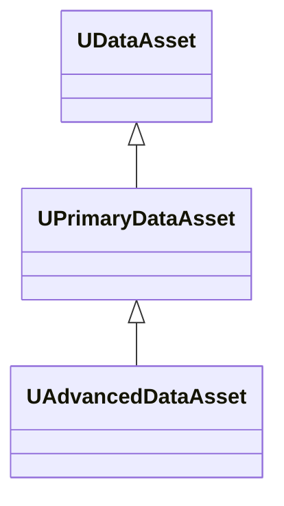
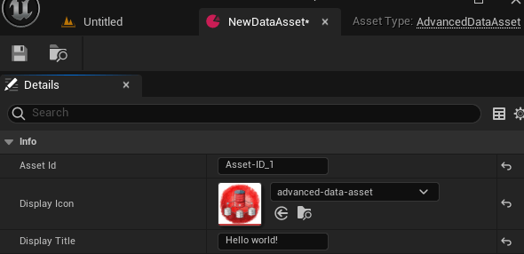
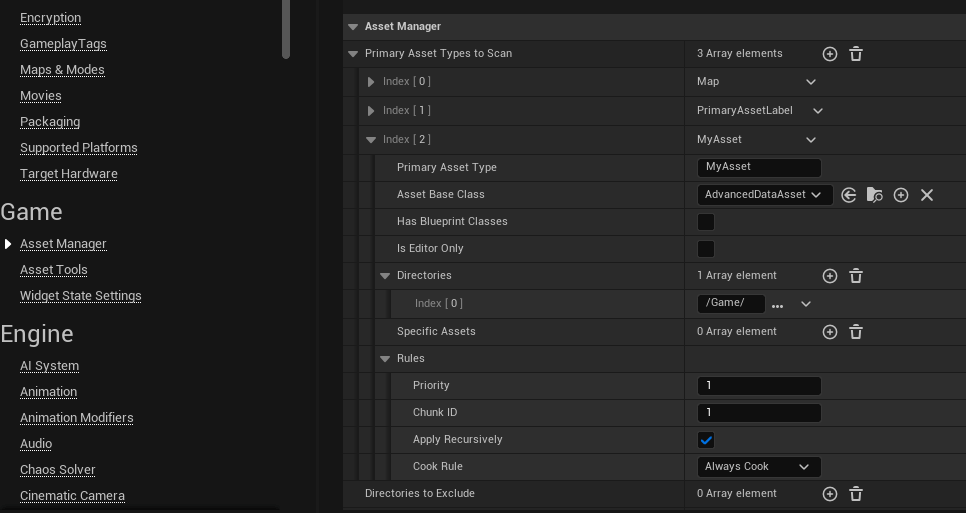
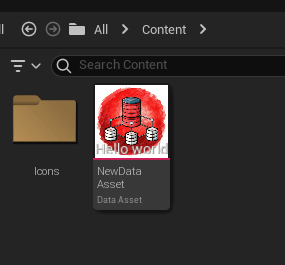

# Advanced Asset Plugin

## About the plugin

> [Github Repository](https://github.com/ArtemIyX/AdvancedAssetUnreal)

Author plugin written for Riftborn. It implements the custom Primary Asset for more convenient and efficient management of assets in the game.

## Overview

The plugin adds a **UAdvancedDataAsset** that inherits from the [UPrimaryDataAsset](https://dev.epicgames.com/documentation/en-us/unreal-engine/API/Runtime/Engine/Engine/UPrimaryDataAsset).



!!! note
    **UPrimaryDataAsset** is DataAsset that implements GetPrimaryAssetId and has asset bundle support, which allows it to be manually loaded/unloaded from the AssetManager.

---

**UAdvancedDataAsset** Uses **GetPrimaryAssetId()** and generates the ID as follows:

```cpp

FPrimaryAssetId(FPrimaryAssetType(AssetType), AssetId)
```

---

## Asset Type

For the ID to be generated correctly, you must specify **AssetType** in the C++ constructor as follows:

```cpp title="MyAdvancedDataAsset.h"
class YOUR_API UMyAdvancedDataAsset : public UAdvancedDataAsset {
	GENERATED_BODY()
public:
  UMyAdvancedDataAsset();
}
```

```cpp title="MyAdvancedDataAsset.cpp"
UMyAdvancedDataAsset::UMyAdvancedDataAsset()
{
  AssetType = TEXT("MyAsset");
}
```

You can now create an instance of the date asset and specify the Asset ID



## Asset Manager

To load assets via **FPrimaryAssetId(AssetType, AssetId)** you need to register an asset in **Asset Manager**.

!!! warning
    For each subclass of data-asset you need to specify a new asset type and register it in Asset Manager!



!!! note
    In the "Primary Asset Type", you must specify the asset type you specified in the constructor.

    In "Asset Base Class" you must specify the created C++ class

---

Now you can load assets with just a Type and ID

```C++ title="MyAssetManager.h"

class YOUR_API UMyAssetManager : public UAssetManager
{
	GENERATED_BODY()

public:

	template <class T>
	T* LoadAsset(FName ID)
	{
		if (const UAdvancedDataAsset* Default = Cast<UAdvancedDataAsset>(T::StaticClass()->GetDefaultObject()))
		{
			const FPrimaryAssetId PrimaryAssetId = FPrimaryAssetId(Default->GetType(), ID);
			const FSoftObjectPath path = GetPrimaryAssetPath(PrimaryAssetId);
			if (T* LoadedItem = Cast<T>(path.TryLoad()))
			{
				return LoadedItem;
			}
		}
		return nullptr;
	}
};
```

## Thumbnail renderer

You can select any icon from the project to display asset. You can also add a short name for the icon.

