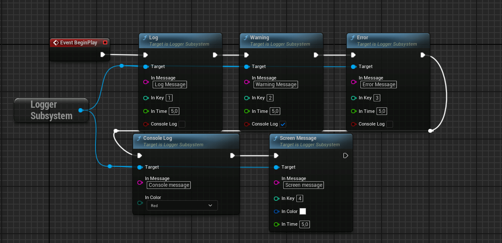
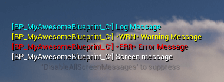
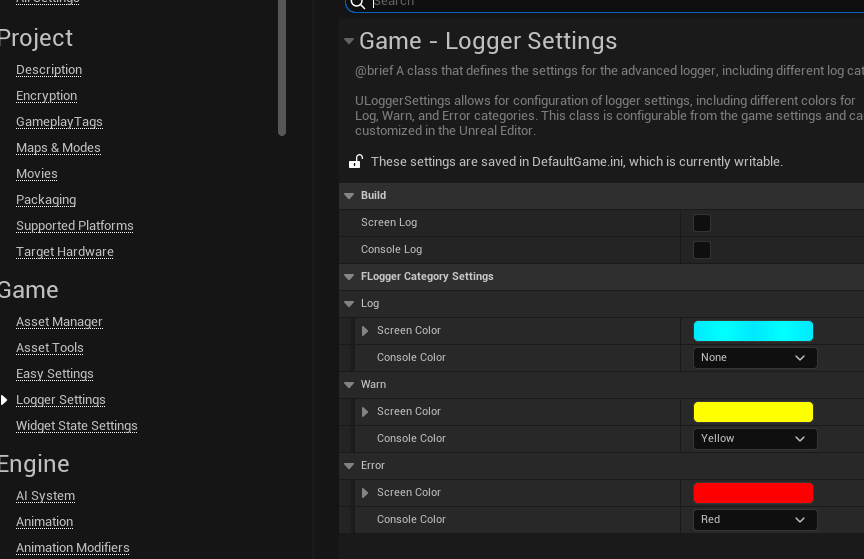

# Advanced Logger

## About the plugin

> [Github Repository](https://github.com/ArtemIyX/AdvancedLoggerUnreal/)

Author plugin written for Riftborn. It adds handy logging tools to C++ and Blueprints.



## Overview

The plugin outputs both on the screen and in the console, displaying the name of the class in which the function was called.



## Settings

You can customize the output categories in the project settings.



## C++ Logs

The plugin also adds useful macros for use in C++

```C++
TRACE(YourCategory, "My text with %s and %d", *myString, myInt);
TRACEWARN(YourCategory, "My text with %s and %d", *myString, myInt);
TRACEERROR(YourCategory, "My text with %s and %d", *myString, myInt);
```

!!! warning
    These macros don't work in static functions and in places where GetWorld() can't be obtained!

If you need to output something to console in a static function use the following:

```C++
TRACESTATIC(YourCategory, "My text with %s and %d", *myString, myInt);
```
!!! note
    In this case, the macro will not display your network mode (Standalone, Client, Server) in the console, but will still display the full name of the function.

---

The plugin provides two macros for displaying on the screen:

```C++
SCREENDEBUG("My text with %s and %d", *myString, myInt);  // Duration: 5.0f
SCREENDEBUGT("My text with %s and %d", *myString, myInt); // Duration: 0.0f
```

!!! note "SCREENDEBUGT"
    The second method  can be used in Tick()
