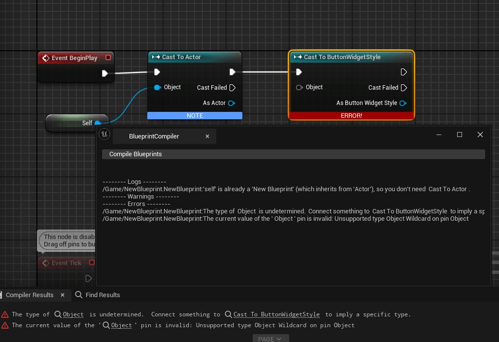
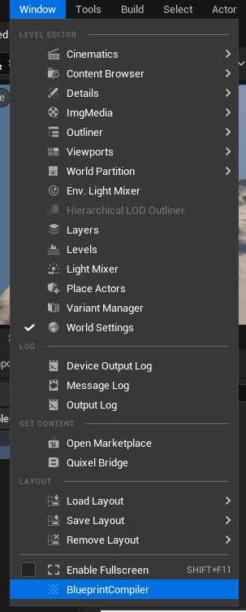

# Blueprint Compile

> [Github Repository](https://github.com/ArtemIyX/BlueprintCompileUnreal/)

## Overview
The plugin allows you to compile all blueprints in project in one click with all errors and logs displayed.

> If you often edit C++ code, you may have noticed that blueprints break and generate errors related to modified .h files.
>This often happens if the project is huge and the engine does not even show errors tab when trying to run the game in the PIE.

You can simply compile the project in Shipping Build in case of strange behavior of Blueprints, but it may take a lot of time.

## Window

To compile all Blueprints in a project, go to Window -> BlueprintCompiler

