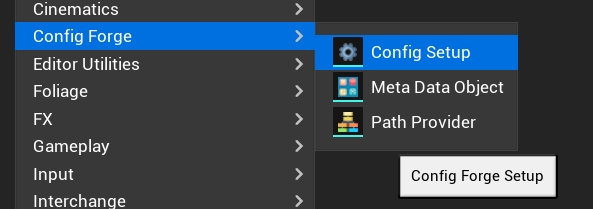
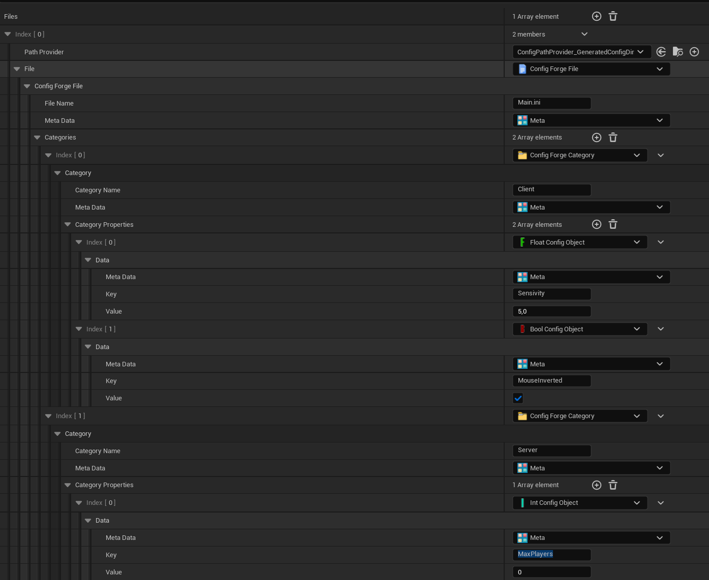
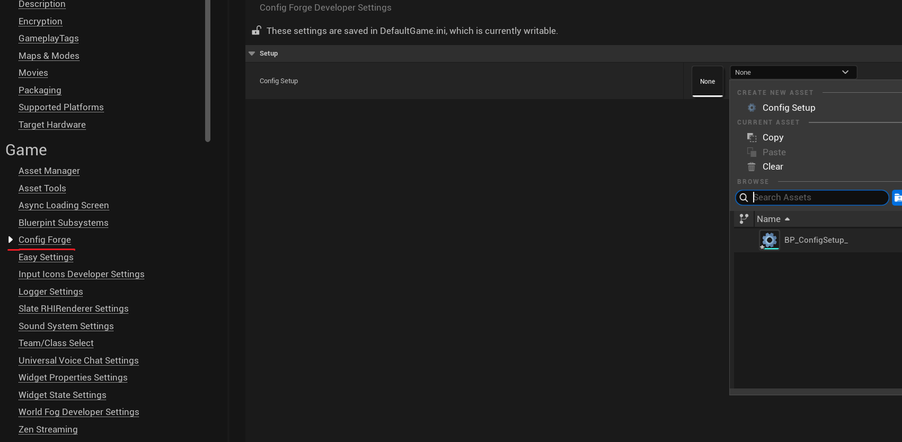
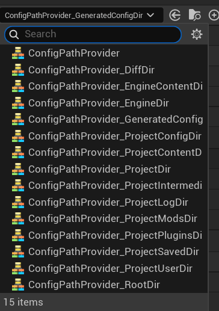
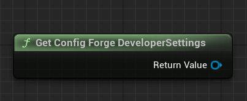
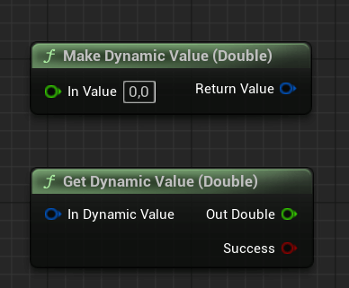
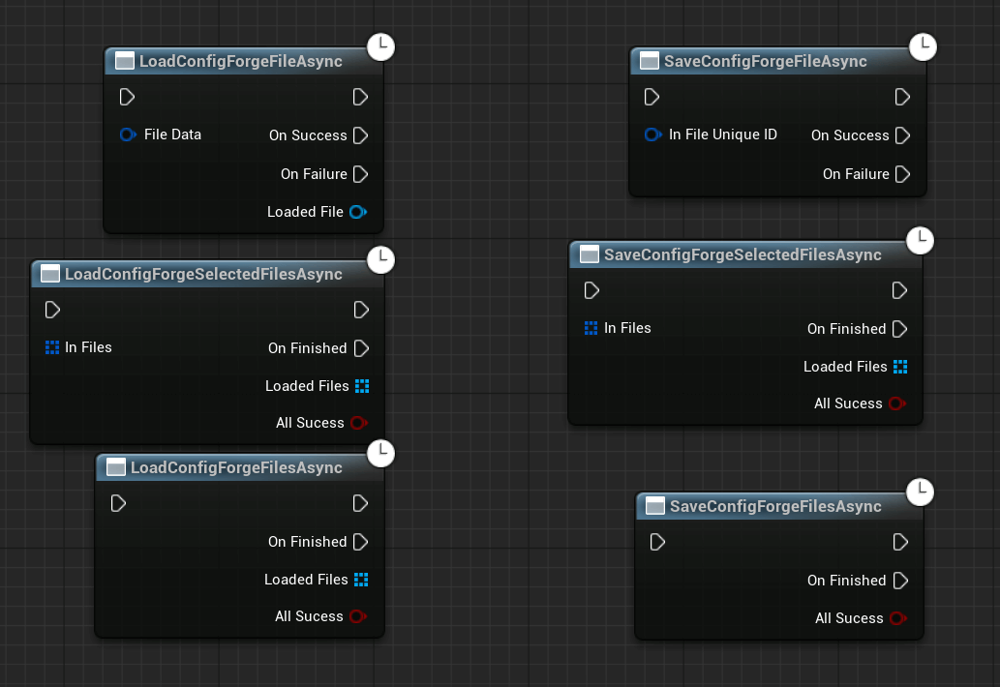
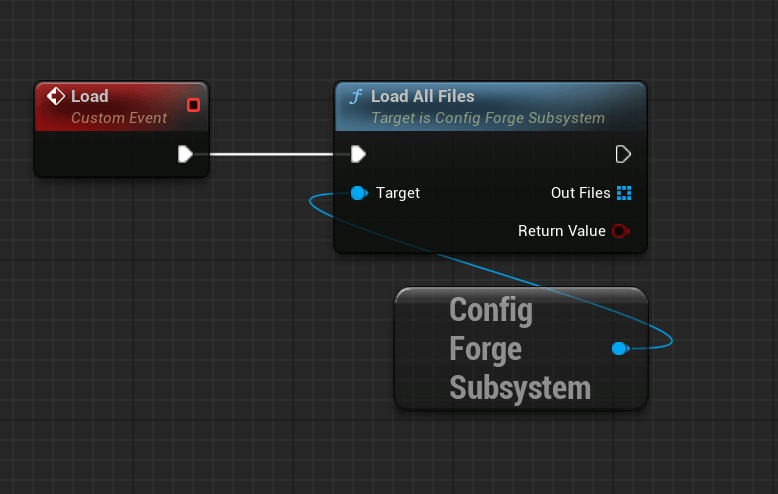
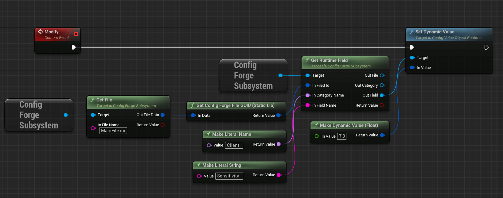
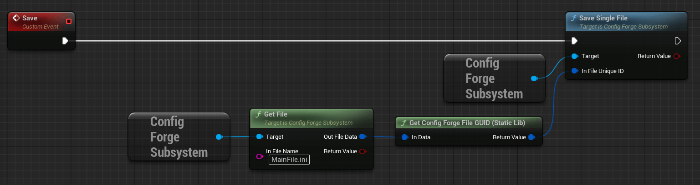

# Config Forge

## About the plugin

> [Github Repository](https://github.com/ArtemIyX/ConfigForgeUnreal)

Author plugin written for Riftborn. 

Plugin that offers a comprehensive system for managing game configurations. It breaks down game configurations into files, categories, and properties that can be easily accessed for both default game configurations, which are asset-based, and saved game configurations, which are stored on disk using a GameInstance system. The plugin supports synchronous or asynchronous loading or saving, offers flexible paths for saving, exposes functions to Blueprints, and offers functionality to be modified at runtime.


See [Example](#blueprint-workflow-example)

## Setup

For the plugin to work, you need to create a few assets and configure them:

### 1. Create ``Config Setup`` Asset

Create a **``Config Setup``**. This is a basic asset that allows you to configure files, categories, and properties.



### 2. Configure Asset

Configure your asset as you see want.



#### Files

You can use the default files or create your own class for processing files.

You can choose where the file will be stored (``Config Provider``) and its name with the ``.ini`` extension.

!!! warning
    ``Config Provider`` and ``Name`` are used to generate the ID, so do not create identical files, as this will cause the system to crash.

#### Categories

Each file can have a lot of categories. 
Each category in the ``.ini`` file will be used via ``[CategoryName]``

!!! warning
    Do not use identical names for categories in the same file, otherwise the system will crash.

#### Fields

Each category can have fields. The plugin provides the entire set of ``.ini`` fields: 

``uint8``, ``int32``, ``int64``, ``float``, ``double``, ``FString``.

> To create your own field type (e.g. array or FVector), inherit from UConfigValueObject in C++ and implement all methods.

!!! warning
    Do not name fields in the same category identically. This may cause the system to crash.


#### Meta

Files, categories, and properties can have Meta Data. This is any object for custom settings.

!!!tip
    You can create ``UConfigForgeMetaDataObject`` for a file that will contain a **ENUM**. Depending on the **ENUM**, you will decide whether you need to upload this file to the **server**, **client**, etc.

### 3. Configure Developer Settings

Select your assend in ``Project Settings / Config Forge``




## UConfigPathProvider

```cpp
class CONFIGFORGE_API UConfigPathProvider : public UObject
```

> Path Provider determines which directory the file will be located in.



You can use the ready-made directories provided by the plugin, or create your own Path Provider.

Just implement
```cpp
FString GetPath() const;
```

## UConfigForgeDeveloperSettings

```cpp
class CONFIGFORGE_API UConfigForgeDeveloperSettings : public UDeveloperSettings
```

```cpp
TSoftObjectPtr<UConfigForgeSetup> ConfigSetup;
```

You can obtain this object in blueprints via

```cpp
static const UConfigForgeDeveloperSettings* Get();
```


In C++ I recommend using
```cpp
const UConfigForgeDeveloperSettings* obj = GetDefault<UConfigForgeDeveloperSettings>();
```

!!!tip
    You can split the logic in C++ using ``#if WITH_EDITOR``. This way, you will use one path in the **EDITOR** and another in the **PACKAGED BUILD**. 

## UConfigForgeFileRuntime
```cpp
class CONFIGFORGE_API UConfigForgeFileRuntime : public UObject
```
> In Runtime, the plugin uses this class to store information about the file on the disk.

You can always use all these getters to obtain information about the file: its name, full path, Path Provider object, the asset you configured, and a unique ID.

```cpp
FString GetFileName() const;
FString GetFullPath() const;
UConfigPathProvider* GetPathProvider() const;
ConfigForgeFile* GetFileAsset() const;

```

!!! info inline
    This ID is used to obtain the runtime file object and can be easily obtained at runtime. 

```cpp
FGuid GetFileID() const;
```

!!! tip
    Always check whether the data is valid with the help of ```cpp bool IsValidData() const;```

## UConfigForgeCategoryRuntime
```cpp
class CONFIGFORGE_API UConfigForgeCategoryRuntime : public UObject
```
> This object contains information about the category: Name, Asset, as well as all of its fields.

```cpp
FName GetCategoryName() const;
UConfigForgeCategory* GetCategoryAsset() const;
```

With the file loaded into RAM, you can get all of its categories. 

You can also always get the file in which this category is located: 
```cpp
UConfigForgeFileRuntime* GetFile() const
```

## UConfigValueObjectRuntime
```cpp
class CONFIGFORGE_API UConfigValueObjectRuntime : public UObject
```
> This object stores any information needed to write to or read from the disk. It is actually a field in an .ini file.

You can obtain the field name and the asset you configured:
```cpp
FString GetKey() const;
UConfigValueObject* GetAsset() const;
```

You can find out which category this field object belongs to:
```cpp
UConfigForgeCategoryRuntime* GetCategory() const
```

The following functions are used to set or retrieve [FDynamicValue](#fdynamicvalue):
```cpp
FDynamicValue GetDynamicValue() const 
void SetDynamicValue(const FDynamicValue& InValue);
```

## FDynamicValue
```cpp
struct CONFIGFORGE_API FDynamicValue
```
> A universal structure for storing any data.

Unfortunately, blueprints are not that flexible, and most of the functionality of this structure is revealed in C++:

```cpp
FDynamicValue val;
val.Set<int>(17);

int temp;
val.Get<int>(temp); // temp will be 17

```

In C++, a structure can be created directly with a value. 
```cpp
FDynamicValue val = FDynamicValue::Make(31.23f);
```

The Blueprints have functions for creating and reading FDynamicValue, but only for the basic data types used in .ini files.



## UConfigForgeSubsystem
```cpp
class CONFIGFORGE_API UConfigForgeSubsystem : public UGameInstanceSubsystem
```
> The main subsystem for file manipulation

### FConfigForgeFileData
```cpp
struct CONFIGFORGE_API FConfigForgeFileData {
    TSubclassOf<UConfigPathProvider> PathProvider;
    TObjectPtr<UConfigForgeFile> File;
}
```
> A structure that contains the PathProvider class and the file name with the extension.

#### FConfigForgeFileData GUID

You can generate a unique ID for the file:
```cpp
FGuid UConfigForgeLibrary::GetForgeFileID(const FConfigForgeFileData& InData)
```

### Asset Functions

#### Get Settings
```cpp
const UConfigForgeDeveloperSettings* GetSettings() const;
```
> Gets the [developer settings](#uconfigforgedevelopersettings) for the ConfigForge system.

#### Get SetupAsset
```cpp
TSoftObjectPtr<UConfigForgeSetup> GetSetupAsset() const;
```
> Retrieves the [setup asset](#1-create-config-setup-asset) reference from developer settings.

#### Get File
```cpp
bool GetFile(const FString& InFileName, FConfigForgeFileData& OutFileData) const;
```
> Retrieves a specific [asset configuration](#fconfigforgefiledata) file by name.

#### Get Files
```cpp
void GetFiles(TArray<FConfigForgeFileData>& OutFiles) const;
```
> Retrieves all valid [configuration files](#fconfigforgefiledata) from the [setup asset](#1-create-config-setup-asset).

#### Get File Names
```cpp
void GetFileNames(TArray<FString>& OutNames) const;
```
> Retrieves the names of all [configuration files](#fconfigforgefiledata) in the [setup asset](#1-create-config-setup-asset.

#### Get File Categories By Name
```cpp
void GetFileCategoriesByName(const FString& InFileName, TArray<FName>& OutCategories);
```
> Retrieves all [category](#categories) names from a file specified by name.

#### Get File Categories
```cpp
void GetFileCategories(const FConfigForgeFileData& InFileData, TArray<FName>& OutCategories);
```
> Retrieves all [category](#categories) names from a [file data structure](#fconfigforgefiledata).

#### Get Category Properties
```cpp
void GetCategoryProperties(const FString& InFileName, const FName& InCategoryName, TArray<UConfigValueObject*>& OutProperties);
```
>  Retrieves all [value objects](#fields) from a specific [category](#categories) within a [file](#files).

### Disk Read/Write Functions
!!!important
    The [subsystem](#uconfigforgesubsystem) can only perform one file operation at a time. 

Therefore, it is not possible to use two asynchronous operations simultaneously.
To check whether the subsystem is currently busy working on files, use:

```cpp
bool IsOperatingFiles() const;
```

#### Single File

#### Load Single File
```cpp
bool LoadSingleFile(const FConfigForgeFileData& InFileData, UConfigForgeFileRuntime*& OutFile);
```
> Synchronously loads a single config [file](#uconfigforgefileruntime) from disk.

#### Load Single File (Async)
```cpp
void LoadSingleFileAsync(const FConfigForgeFileData& InFileData, FLoadForgeFileDelegate Callback);
```
> Asynchronously loads a single config [file](#uconfigforgefileruntime) from disk.

#### Save Single File
```cpp
bool SaveSingleFile(const FGuid& InFileUniqueID);
```
> Synchronously saves a single loaded config [file](#uconfigforgefileruntime) to disk.

#### Save Single File 
```cpp
void SaveSingleFileAsync(const FGuid& InFileUniqueID, FSaveForgeFileDelegate Callback);
```
> Asynchronously saves a single loaded config [file](#uconfigforgefileruntime) to disk.

### All files

#### Load ALL Files
```cpp
bool LoadAllFiles(TArray<UConfigForgeFileRuntime*>& OutFiles);
```
> Loads all configuration [files](#uconfigforgefileruntime) synchronously.

#### Load ALL File (Async)
```cpp
void LoadAllFilesAsync(FLoadAllForgeFileDelegate Callback);
```
> Loads all configuration [files](#uconfigforgefileruntime) asynchronously.

#### Save ALL Files
```cpp
bool SaveAllFiles();
```
> Saves all currently loaded runtime configuration [filess](#uconfigforgefileruntime) synchronously.

#### Save ALL Files (Async)
```cpp
void SaveAllFilesAsync(FSaveAllForgeFileDelegate Callback);
```
> Saves all currently loaded runtime configuration [files](#uconfigforgefileruntime) asynchronously.

### Selected Files

#### Load Selected Files
```cpp
bool LoadSelectedFiles(const TArray<FConfigForgeFileData>& InFiles, TArray<UConfigForgeFileRuntime*>& OutFiles);
```
> Synchronously loads a selected subset of config files into runtime [files](#uconfigforgefileruntime).

#### Load Selected Files (Async)
```cpp
void LoadSelectedFilesAsync(const TArray<FConfigForgeFileData>& InFiles, FLoadAllForgeFileDelegate Callback);
```
> Asynchronously loads a selected subset of config files into runtime [files](#uconfigforgefileruntime).

#### Save Selected Files
```cpp
bool SaveSelectedFiles(const TArray<FGuid>& InFiles);
```
> Saves selected loaded runtime configuration [files](#uconfigforgefileruntime) synchronously.

#### Save Selected Files (Async)
```cpp
void SaveSelectedFilesAsync(const TArray<FGuid>& InFiles, FSaveSelectedForgeFileDelegate Callback);
```
> Saves selected loaded runtime configuration [files](#uconfigforgefileruntime) asynchronously.

### Runtime Functions

#### Get Runtime File
```cpp
bool GetRuntimeFile(const FGuid& InUniqueFileId, UConfigForgeFileRuntime*& OutRuntimeFile) const;
```
> Retrieves a loaded [runtime file](#uconfigforgefileruntime) instance by its unique [ID](#fconfigforgefiledata-guid).

#### Get All Runtime Files
```cpp
void GetAllRuntimeFiles(TArray<UConfigForgeFileRuntime*>& OutRuntimeFiles) const;
```
>  Retrieves all runtime [configuration files](#uconfigforgefileruntime) currently loaded in the [subsystem](#uconfigforgesubsystem).

#### Get Runtime Categories
```cpp
bool GetRuntimeCategories(const UConfigForgeFileRuntime* InConfigFile, TArray<UConfigForgeCategoryRuntime*>& OutCategories) const;
```
> Retrieves all [categories](#uconfigforgecategoryruntime) from a specific [runtime configuration file](#uconfigforgefileruntime).

#### Get Runtime Categories (By File ID)
```cpp
bool GetRuntimeCategories_ID(const FGuid& InFileId, TArray<UConfigForgeCategoryRuntime*>& OutCategories) const;
```
> Retrieves all [categories](#uconfigforgecategoryruntime) from a [runtime configuration file](#uconfigforgefileruntime) identified by its [ID](#fconfigforgefiledata-guid).

#### Get Runtime Category
```cpp
bool GetRuntimeCategory(const UConfigForgeFileRuntime* InConfigFile, const FName& InCategoryName, UConfigForgeCategoryRuntime*& OutCategory) const;
```
> Retrieves a specific [category](#uconfigforgecategoryruntime) by name from a [runtime configuration file](#uconfigforgefileruntime).

#### Get Runtime Category (By File ID)
```cpp
bool GetRuntimeCategory_ID(const FGuid& InFileId, const FName& InCategoryName, UConfigForgeCategoryRuntime*& OutCategory) const;
```
> Retrieves a specific [category](#uconfigforgecategoryruntime) by name from a [runtime configuration file](#uconfigforgefileruntime) identified by its [ID](#fconfigforgefiledata-guid).

#### Get Runtime Field (Full info return)
```cpp
bool GetRuntimeField_Full(const FGuid& InFiledId, const FName& InCategoryName, const FString& InFieldName,
		UConfigForgeFileRuntime*& OutFile,
		UConfigForgeCategoryRuntime*& OutCategory,
		UConfigValueObjectRuntime*& OutField) const;
```
> Retrieves a [runtime field](#uconfigvalueobjectruntime) by providing its file [ID](#fconfigforgefiledata-guid), [category](#uconfigforgecategoryruntime) name, and [field](#uconfigvalueobjectruntime) name.

#### Get Runtime Field
```cpp
bool GetRuntimeField(const UConfigForgeCategoryRuntime* InRuntimeCategory, const FString& InKey, UConfigValueObjectRuntime*& OutField) const;
```
> Retrieves a specific [field](#uconfigvalueobjectruntime) by key from a [runtime category](#uconfigforgecategoryruntime).

#### Get Runtime Field (By File Object)
```cpp
bool GetRuntimeField_File(const UConfigForgeFileRuntime* InConfigFile, const FName& InCategoryName, const FString& InKey, UConfigValueObjectRuntime*& OutField) const;
```
> Retrieves a specific [field](#uconfigvalueobjectruntime) by key from a [category](#uconfigforgecategoryruntime) within a [runtime configuration file](#uconfigforgefileruntime).

#### Get Runtime Field (By File ID)
```cpp
bool GetRuntimeField_ID(const FGuid& InFileID, const FName& InCategoryName, const FString& InKey, UConfigValueObjectRuntime*& OutField) const;
```
> Retrieves a specific [field](#uconfigvalueobjectruntime) by key from a [category](#uconfigforgecategoryruntime) within a [runtime configuration file](#uconfigforgefileruntime) identified by its [ID](#fconfigforgefiledata-guid).

#### Get Runtime Fields
```cpp
bool GetRuntimeFields(const UConfigForgeCategoryRuntime* InRuntimeCategory, TArray<UConfigValueObjectRuntime*>& OutFields) const;
```
> Retrieves all [fields](#uconfigvalueobjectruntime) from a [runtime category](#uconfigforgecategoryruntime).

#### Get Runtime Fields (By File Object)
```cpp
bool GetRuntimeFields_File(const UConfigForgeFileRuntime* InConfigFile, const FName& InCategoryName, TArray<UConfigValueObjectRuntime*>& OutFields) const;
```
> Retrieves all [fields](#uconfigvalueobjectruntime) from a [runtime category](#uconfigforgecategoryruntime) within a [runtime configuration file](#uconfigforgefileruntime).

#### Get Runtime Fields (By File ID)
```cpp
bool GetRuntimeFields_ID(const FGuid& InFileID, const FName& InCategoryName, TArray<UConfigValueObjectRuntime*>& OutFields) const;
```
>  Retrieves all [fields](#uconfigvalueobjectruntime) from a [runtime category](#uconfigforgecategoryruntime) within a[runtime configuration file](#uconfigforgefileruntime) identified by its [ID](#fconfigforgefiledata-guid).


### Events

#### On All Files Loaded
```cpp
FConfigForgeSubsystemDelegate OnAllFilesLoaded;
```
> Called when [``UConfigForgeSubsystem::LoadAllFiles``](#load-all-files) and [``ConfigForgeSubsystem::LoadAllFilesAsync``](#load-all-file-async) finishes loading.

#### On All Files Saved
```cpp
FConfigForgeSubsystemDelegate OnAllFilesSaved;
```
> Called when [``UConfigForgeSubsystem::SaveAllFiles``](#save-all-files) and [``ConfigForgeSubsystem::SaveAllFilesAsync``](#save-all-files-async) finishes saving.

#### On File Loaded
```cpp
FConfigForgeSubsystemFileDelegate OnFileLoaded;
```
> Called when any function has saved [runtime file](#uconfigforgefileruntime) to disk.

#### On File Saved
```cpp
FConfigForgeSubsystemFileDelegate OnFileSaved;
```
> Called when any function has loaded [runtime file](#uconfigforgefileruntime) from disk.

#### On Value Changed (UConfigValueObjectRuntime)
```cpp
FConfigValueChangedDelegate UConfigValueObjectRuntime::OnValueChanged;
```
> Called when SetDynamicValue changes the value


## Blueprint Async (K2) Nodes



All async function are exposed to blueprints via K2 Nodes

## Blueprint Workflow Example

### Load



!!!tip
    You can load only the files you need based on the meta data object. For example, download only server configurations on the dedicated server.

### Modify


!!!tip
    You can store in variable the field object reference (pointer) and then change it in the widget. It will remain valid until you reload the file.

### Save


!!!tip
    You can only save the files you have changed. It is not necessary to load the disc and save all the files if you have a lot of them.

### Misc

!!!info
    You can create a naming system so that you don't have to name files manually and can easily change their names during development.